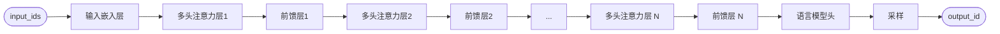

:::abstract
前缀缓存是一种大模型推理优化技术，通过缓存已处理输入序列的中间计算结果，显著提升生成式任务的效率。
当输入包含重复前缀（如多轮对话的共享历史或批量请求中的重叠前缀文本）时，模型可直接复用缓存结果，避免重复计算，同时保持输出一致性。
:::

<!-- more -->

## 在本地通过 transformers 库推理 Qwen3-0.6B

### 下载模型文件

从 Huggingface 上克隆 Qwen3-0.6B 的模型文件：

```terminal
$ git clone --depth=1 https://huggingface.co/Qwen/Qwen3-0.6B
正克隆到 'Qwen3-0.6B'...
remote: Enumerating objects: 11, done.
remote: Counting objects: 100% (11/11), done.
remote: Compressing objects: 100% (11/11), done.
remote: Total 11 (delta 0), reused 0 (delta 0), pack-reused 0 (from 0)
展开对象中: 100% (11/11), 1.72 MiB | 4.31 MiB/s, 完成.
$ ls -hl ./Qwen3-0.6B/
total 1.5G
-rw-r--r-- 1 urie users  726  6月 25 14:56 config.json
-rw-r--r-- 1 urie users  239  6月 25 14:56 generation_config.json
-rw-r--r-- 1 urie users 1.6M  6月 25 14:56 merges.txt
-rw-r--r-- 1 urie users 1.5G  6月 25 14:57 model.safetensors
-rw-r--r-- 1 urie users  14K  6月 25 14:56 README.md
-rw-r--r-- 1 urie users 9.6K  6月 25 14:56 tokenizer_config.json
-rw-r--r-- 1 urie users  11M  6月 25 14:56 tokenizer.json
-rw-r--r-- 1 urie users 2.7M  6月 25 14:56 vocab.json
```

| 文件名                 | 作用                                                                                           | 预览              |
| :--------------------- | :--------------------------------------------------------------------------------------------- | :---------------- |
| model.safetensors      | 模型的权重文件，训练就是不断调整这些参数                                                       |  |
| config.json            | 定义了模型的结构参数，如隐藏层维度、张量数值类型、注意力头数、词表大小等                       |  |
| generation_config.json | 模型推理时的默认参数，如温度、top_p 等。如果请求大模型没有带这些参数，就会用这里定义的默认值。 |  |
| tokenizer.json         | 分词器配置，比如分词规则、token 词表（图里的 vocab 字段）                                      |  |
| tokenizer_config.json  | 另一个分词器配置，包含特殊 token、prompt 模板等                                                |  |

### 通过 pipeline 生成文本

使用 transformers 的 pipeline 加载本地下载好的 qwen3-0.6b 模型并生成文本：

```Python
from transformers.pipelines import pipeline

pipe = pipeline(task="text-generation", model="./Qwen3-0.6B/")
print(
    pipe("明月几时有，把酒问")
)  # [{'generated_text': '明月几时有，把酒问青天？——李白《静夜思》\n这首诗中，作者通过描绘月圆之夜的宁静、清冷、孤独，表达了对故乡的思念之情。……
```

pipeline函数屏蔽了底层细节，输入 prompt 之后直接就输出补全的内容，下面会继续拆解。

### 将请求体拼接为一个文本

我们请求大模型时，往往是传一堆 message 给模型。模型拿到这堆 message，需要先合并成一个文本。
AutoTokenizer 会按照模型文件里 tokenizer_config.json 配置的规则来生成：

```Python
from transformers import AutoTokenizer

tokenizer = AutoTokenizer.from_pretrained("./Qwen3-0.6B/")
text = tokenizer.apply_chat_template(
    [
        {"role": "system", "content": "请帮我翻译为英语"},
        {"role": "user", "content": "小荷健康"},
    ],
    tokenize=False,
    add_generation_prompt=True,
)

print(text)
# 输出：
# <|im_start|>system
# 请帮我翻译为英语<|im_end|>
# <|im_start|>user
# 小荷健康<|im_end|>
# <|im_start|>assistant
```

> - `<|im_start|>`这些就是特殊 token，大模型会特殊处理这些 token；
> - 生成的文本最后加了一个`<|im_start|>assistant`，让模型生成的是回复，而不是对用户的提问继续生成；
> - qwen 支持思考模式，如果不想开启思考模式，可以在 text 末尾添加`<think>\n\n</think>`这样一个空的思考标签，模型就会从`</think>`开始生成正文部分；
> - tokenizer_config.json 里配置的模板，大部分内容都是对 function call 的拼接处理：
>
> ::: details 展开查看
> <<< ./snippets/show_tokenizer_config_json
> :::

### 分词

拿到上面输出的文本，现在对这段文本进行分词处理。
AutoTokenizer 从模型文件的 tokenizer.json 知道需要用 BPE 分词，
分词得到若干个 token 后，再根据这个文件定义的词表，将每一个 token 映射为 input_id。

```Python
from transformers import AutoTokenizer

tokenizer = AutoTokenizer.from_pretrained("./Qwen3-0.6B/")
tokens = tokenizer.tokenize("明月几时有，把酒问")
print(tokens)  # 输出：['æĺİ', 'æľĪ', 'åĩł', 'æŶ', 'æľī', 'ï¼Į', 'æĬĬ', 'éħĴ', 'éĹ®']
input_ids = tokenizer.convert_tokens_to_ids(tokens)
print(input_ids)  # 输出：[30858, 9754, 99195, 13343, 18830, 3837, 99360, 99525, 56007]
```

这几个 input_id 正好在词表中对应这些 token：

```terminal
$ grep -E '\b(30858|9754|99195|13343|18830|3837|99360|99525|56007)\b' <./Qwen3-0.6B/tokenizer.json
      "ï¼Į": 3837,
      "æľĪ": 9754,
      "æŶ": 13343,
      "æľī": 18830,
      "æĺİ": 30858,
      "éĹ®": 56007,
      "åĩł": 99195,
      "æĬĬ": 99360,
      "éħĴ": 99525,
```

Input_ids 也可以转回 token，并拼接成原文本：

```Python
for input_id in input_ids:
    print(tokenizer.decode(input_id))
    # 输出：
    # 明
    # 月
    # 几
    # 时
    # 有
    # ,
    # 把
    # 酒
    # 问
```

### 一次迭代

输入的 input_ids 经过一次网络，可以得到下一个 token：

```Python
from transformers import AutoTokenizer, AutoModelForCausalLM
import torch

tokenizer = AutoTokenizer.from_pretrained("./Qwen3-0.6B/")
inputs = tokenizer("明月几时有，把酒问", return_tensors="pt")

model = AutoModelForCausalLM.from_pretrained("./Qwen3-0.6B/")
outputs = model(
    input_ids=inputs["input_ids"],
    attention_mask=inputs["attention_mask"],
)
next_token_logits = outputs.logits[0, -1, :]
next_token_id = torch.argmax(next_token_logits).item()
print(tokenizer.decode(next_token_id))  # "青"
```

输出的 logits 的最后一行表示对下一个 token 的预测分数，
经 softmax 转换后就是词表中每个 token 的概率分布，
这里可以直接取概率最高的 token，
也可以根据配置的温度、top_k 等参数来抽样取 token，实现输出多样性。

### 继续迭代生成文本

生成的这一个 token 再拼接到输入 token 后面，再走一遍网络，
得到第二个输出 token。如此循环 10 次，输出 10 个 token：

```Python
from transformers import AutoTokenizer, AutoModelForCausalLM
import torch

tokenizer = AutoTokenizer.from_pretrained("./Qwen3-0.6B/")
inputs = tokenizer("明月几时有，把酒问", return_tensors="pt")

input_ids = inputs["input_ids"]

model = AutoModelForCausalLM.from_pretrained("./Qwen3-0.6B/")

for i in range(10):
    outputs = model(input_ids=input_ids, attention_mask=torch.ones_like(input_ids))
    # 获取最后一个token的logits，用于预测下一个token
    next_token_logits = outputs.logits[0, -1, :]
    next_token_id = torch.argmax(next_token_logits).item()
    print(tokenizer.decode(next_token_id), end="")

    # 将新生成的token_id添加到input_ids用来继续生成下一个token
    input_ids = torch.cat([input_ids, torch.tensor([[next_token_id]])], dim=1)

# 输出：
# 青天。对酒当歌，人生几
```

### 使用 KV cache

上面的每一次迭代，都会将所有输入完整过一遍网络，
但是每次输入的内容只差一个 token，
中间变量是有可以复用的部分，缓存起来避免重复计算。

> [!NOTE]
> 这个 KV cache 里的 KV 不是 map 的key value，
> 而是 Attention 层的两个矩阵叫 K 和 V ，下面会讲

```Python
from transformers import AutoTokenizer, AutoModelForCausalLM
import torch

tokenizer = AutoTokenizer.from_pretrained("./Qwen3-0.6B/")
inputs = tokenizer("明月几时有，把酒问", return_tensors="pt")

input_ids = inputs["input_ids"]
attention_mask = torch.ones_like(input_ids)
past_key_values = None  # 保存kv cache

model = AutoModelForCausalLM.from_pretrained("./Qwen3-0.6B/")

for _ in range(10):
    # 如果有kv cache，只需要输入最后一个token即可
    outputs = model(
        input_ids=input_ids if past_key_values is None else input_ids[:, -1:],
        attention_mask=torch.ones_like(input_ids),
        past_key_values=past_key_values,
    )
    past_key_values = outputs.past_key_values  # 更新为这次产生的kv cache
    next_token_logits = outputs.logits[0, -1, :]
    next_token_id = torch.argmax(next_token_logits).item()
    print(tokenizer.decode(next_token_id), end="")

    input_ids = torch.cat([input_ids, torch.tensor([[next_token_id]])], dim=1)

# 输出（和不使用 KV cache 时是一样的）：
# 青天。对酒当歌，人生几
```

第一次迭代时，没有 KV cache，需要输入全部 token 进行计算，
生成第一个 token 之前叫 **prefill** 阶段。

第二次迭代时，可以使用第一次迭代生成的 KV cache 进行计算，
因为 cache 里面已经包含了 “明月几时有，把酒问”，
所以这一次输入的 token 只需要包含上次生成的新 token （“青”）即可。
生成第一个 token 之后叫 **decoding** 阶段。

在大模型推理中 KV cache 是对 decoding 阶段的优化。

> [!TIP]
> 平时流式请求大模型时，可以直观感受到第一个 token 生成得比较慢，
> 后续 token 生成的比较快，其中一方面的原因就是生成第一个 token 时没有 KV cache。

### 使用前缀缓存

前缀缓存就是把前缀的 KV cache 缓存起来，
新请求来了之后，生成第一个 token 时可以复用一部分前缀的 KV cache，
目的是为了优化 prefill 阶段。

下面代码中，先生成 sp 的 KV cache，
后面请求中不需要再传 sp，模型也遵从 sp 指令正确输出了英语。

```Python
from transformers import AutoTokenizer, AutoModelForCausalLM
import torch

tokenizer = AutoTokenizer.from_pretrained("./Qwen3-0.6B/")
model = AutoModelForCausalLM.from_pretrained("./Qwen3-0.6B/")


def create_prefix_cache(prefix):
    text = tokenizer.apply_chat_template(
        prefix, tokenize=False, add_generation_prompt=False, enable_thinking=False
    )
    inputs = tokenizer(text, return_tensors="pt")
    input_ids = inputs["input_ids"]
    attention_mask = torch.ones_like(input_ids)
    outputs = model(input_ids=input_ids, attention_mask=attention_mask)
    return outputs.past_key_values, input_ids.shape[1]


def generate(input_ids, attention_mask, past_key_values):
    gen_text = ""
    for _ in range(500):
        outputs = model(
            input_ids=input_ids,
            attention_mask=attention_mask,
            past_key_values=past_key_values,
        )
        next_token_logits = outputs.logits[0, -1, :]
        next_token_id = torch.argmax(next_token_logits).item()
        decoded_token = tokenizer.decode(next_token_id)
        if decoded_token == "<|im_end|>":
            break
        past_key_values = (
            outputs.past_key_values
        )  # 更新kv cache, decoding 阶段不再需要前缀缓存
        input_ids = torch.tensor(
            [[next_token_id]]
        )  # decoding 阶段只需要输入最后一个token
        attention_mask = torch.cat([attention_mask, torch.tensor([[1]])], dim=1)
        gen_text += decoded_token
    return gen_text


def generate_using_prefix_cache(msg, prefix_key_values, prefix_token_length):
    suffix_text = tokenizer.apply_chat_template(
        msg, tokenize=False, add_generation_prompt=True
    )
    user_inputs = tokenizer(suffix_text, return_tensors="pt")
    input_ids = user_inputs["input_ids"]
    attention_mask = torch.ones(
        1, prefix_token_length + input_ids.shape[1], dtype=torch.int64
    )

    return generate(input_ids, attention_mask, prefix_key_values)


prefix_key_values, prefix_token_length = create_prefix_cache(
    [{"role": "system", "content": "你是一个英语翻译专家，请帮我把中文翻译为英语"}]
)  # 创建前缀缓存

# 使用前缀缓存优化 prefill 阶段
msg = [{"role": "user", "content": "小荷健康"}]
print(generate_using_prefix_cache(msg, prefix_key_values, prefix_token_length))

# 输出：
# <think>
# 好的，用户让我把“小荷健康”翻译成英语。首先，我需要确认这个短语的含义。小荷通常指荷花，所以可能是一个植物名称或者某种健康状态的描述。用户可能是在写产品名称、品牌名，或者某个产品的健康状态。
#
# 接下来，我需要考虑不同的可能性。如果“小荷”是品牌名，可能直接翻译为“Lily Health”比较合适，因为“小荷”对应“lily”。如果是产品名称，可能需要保持原意，比如“Lily Health Product”。另外，用户可能希望保持简洁，所以直接翻译即可。
#
# 还要注意大小写和标点符号，确保翻译准确。比如“小荷健康”中的“小荷”可能需要保持首字母大写，因为品牌名通常首字母大写。同时，整个短语的结构是否需要调整，比如是否需要加连字符或者保持原样。
#
# 最后，检查是否有其他可能的翻译方向，比如是否指荷花的健康状态，但根据常见用法，直接翻译为“Lily Health”更合适。确认无误后，给出翻译结果。
# </think>
#
# Lily Health
```

接下来将继续探索 `model()` 函数底层做了什么，什么是 KV cache，以及为什么它可以复用。

## Transformer 模型

Transformer 是一种基于自注意力机制的深度学习模型，
它与传统的循环和卷积神经网络不同，通过并行处理序列数据实现高效训练，
广泛应用于自然语言处理（如BERT、GPT）等领域。
核心组件包括多头注意力、位置编码和前馈网络，擅长捕捉长距离依赖关系。

整个链路：



打印`model()`全貌：

```Python
from transformers import AutoModelForCausalLM

model = AutoModelForCausalLM.from_pretrained("./Qwen3-0.6B/")

sum(p.numel() for p in model.parameters())  # 596049920
print(model)
# 输出：
# Qwen3ForCausalLM(
#   (model): Qwen3Model(
#     (embed_tokens): Embedding(151936, 1024)
#     (layers): ModuleList(
#       (0-27): 28 x Qwen3DecoderLayer(
#         (self_attn): Qwen3Attention(
#           (q_proj): Linear(in_features=1024, out_features=2048, bias=False)
#           (k_proj): Linear(in_features=1024, out_features=1024, bias=False)
#           (v_proj): Linear(in_features=1024, out_features=1024, bias=False)
#           (o_proj): Linear(in_features=2048, out_features=1024, bias=False)
#           (q_norm): Qwen3RMSNorm((128,), eps=1e-06)
#           (k_norm): Qwen3RMSNorm((128,), eps=1e-06)
#         )
#         (mlp): Qwen3MLP(
#           (gate_proj): Linear(in_features=1024, out_features=3072, bias=False)
#           (up_proj): Linear(in_features=1024, out_features=3072, bias=False)
#           (down_proj): Linear(in_features=3072, out_features=1024, bias=False)
#           (act_fn): SiLU()
#         )
#         (input_layernorm): Qwen3RMSNorm((1024,), eps=1e-06)
#         (post_attention_layernorm): Qwen3RMSNorm((1024,), eps=1e-06)
#       )
#     )
#     (norm): Qwen3RMSNorm((1024,), eps=1e-06)
#     (rotary_emb): Qwen3RotaryEmbedding()
#   )
#   (lm_head): Linear(in_features=1024, out_features=151936, bias=False)
# )
```

### 输入嵌入层

经过前面分词器的处理，我们拿到了一组 input_id，每个 input_id 对应一个 token。
但是 input_id 是离散的整数，没有语义信息，两个语义相似的 token 会有完全不同的 input_id。

所以每个 input_id 还需要转为一个高维向量，
向量距离越小的 token 语义越相似，
这样大模型可以从向量中学习到更复杂的语义和上下文信息。

#### 词嵌入

根据嵌入层的权重矩阵将 input_id 转成向量，
不同位置的 input_id 也会被转为同样的向量。

```Python
from transformers import AutoTokenizer, AutoModelForCausalLM
import torch
import torch.nn.functional as F

model = AutoModelForCausalLM.from_pretrained("./Qwen3-0.6B/")
tokenizer = AutoTokenizer.from_pretrained("./Qwen3-0.6B/")

input_ids = tokenizer(["猫", "狗", "热"])["input_ids"]
embeddings = model.get_input_embeddings()

em = embeddings(torch.tensor([input_ids]))[0]
print(F.cosine_similarity(em[0], em[1]))  # 猫 狗 0.4233
print(F.cosine_similarity(em[0], em[2]))  # 猫 热 0.0591
print(F.cosine_similarity(em[1], em[2]))  # 狗 热 0.0231
```

这个模型的嵌入层是 $151936 \times 1024$ 的二维数组，
词表里的每一个 token，都会转成 1024 维向量。

简单计算一下“猫”和“狗”的余弦相似度比“猫”和“热”大得多。

#### 位置嵌入

因为 transformer 使用的自注意力机制没有感知 token 顺序的能力，
如果仅有词嵌入，那“猫吃鱼”和“鱼吃猫”将被视为相同。

所以需要将位置显式地注入向量，供模型捕捉。
位置嵌入的计算公式为：

$$
PE_{(pos, 2i)} = \sin\left(\frac{pos}{10000^{2i/d_{model}}}\right)
\ \ \ , \ \
PE_{(pos, 2i+1)} = \cos\left(\frac{pos}{10000^{2i/d_{model}}}\right)
$$

其中，$po$是 token 在文本中所处的位置（从 0 开始），
$i$是向量维度索引，$d_{model}$ 是总维度（即 1024）。

例如，前 1000 个 token 生成的位置嵌入分别是：

$$
\begin{bmatrix}
pe_1 \\
pe_2 \\
\vdots \\
pe_\text{1000}
\end{bmatrix}
=
$$

$$
\begin{bmatrix}
\sin\left(\frac{0}{10000^{0/1024}}\right) & \cos\left(\frac{0}{10000^{0/1024}}\right) &
\sin\left(\frac{0}{10000^{2/1024}}\right) &
\cos\left(\frac{0}{10000^{2/1024}}\right) &
\cdots &
\sin\left(\frac{0}{10000^{1024/1024}}\right) &
\cos\left(\frac{0}{10000^{1024/1024}}\right) &
 \\
 \\
\sin\left(\frac{1}{10000^{0/1024}}\right) & \cos\left(\frac{1}{10000^{0/1024}}\right) &
\sin\left(\frac{1}{10000^{2/1024}}\right) &
\cos\left(\frac{1}{10000^{2/1024}}\right) &
\cdots &
\sin\left(\frac{1}{10000^{1024/1024}}\right) &
\cos\left(\frac{1}{10000^{1024/1024}}\right) &
\\
\vdots &
\vdots &
\vdots &
\vdots & &
\vdots &
\vdots &
 \\
\sin\left(\frac{999}{10000^{0/1024}}\right) & \cos\left(\frac{999}{10000^{0/1024}}\right) &
\sin\left(\frac{999}{10000^{2/1024}}\right) &
\cos\left(\frac{999}{10000^{2/1024}}\right) &
\cdots &
\sin\left(\frac{999}{10000^{1024/1024}}\right) &
\cos\left(\frac{999}{10000^{1024/1024}}\right) &

\end{bmatrix}
$$

$$
=
\begin{bmatrix}
0 & 1 & 0 & \cdots & 1 \\
0.8415 & 0.5403 & 0.8317 & \cdots & 1 \\
\vdots & \vdots & \vdots & \  & \vdots \\
-0.0265 & 0.9996 & 0.8483 & \cdots & 0.9948
\end{bmatrix}
$$

利用正弦/余弦函数，文本长度不会受到限制，
且输出范围在 $[-1,1]$，与词嵌入相加后不会造成显著影响。

向量低维度（比如第一列）的正弦波长较短，
可以捕捉局部细粒度的位置（可以让模型区分开“猫吃鱼”和“鱼吃猫”）；高维度（比如最后一列）的正弦波长较长，
可以捕捉全局粗粒度的位置（可以让模型知道这个 token 处在整个文本序列的后面部分）。

词向量和位置嵌入按位相加得到输入到模型的最终嵌入
$
X = \begin{bmatrix}
x_1 \\
x_2 \\
\vdots \\
x_\text{1000}
\end{bmatrix}
= \begin{bmatrix}
te_1 + pe_1 \\
te_2 + pe_2 \\
\vdots \\
te_\text{1000} + pe_\text{1000}
\end{bmatrix}
$


### 解码器层

#### 自注意力机制

$X$会经过 N 个相同结构的多头注意力层，
每个多头注意力层是多个自注意力结构的合并，
单个多头注意力层中每个头学习不同方面的关系，以避免单一注意力的局限性。

自注意力机制通过将输入$X$线性变换为 3 个矩阵$Q$(query)、$K$(Key) 和$V$(Value) 来处理，
每个矩阵都是嵌入向量$x_i$乘以 3 个经过训练的权重矩阵得到：

- Query（查询向量）：$q_i=x_iW^Q$

- Key（键向量）：$k_i=x_iW^K$

- Value（值向量）：$v_i=x_iW^V$

其中$Q$和$K$关注不同 token 之间的相关性，$V$关注需要实际提取的信息。
自注意力矩阵的计算公式：
$\text{Attention}(Q, K, V) = \text{softmax}\left(\frac{QK^\top}{\sqrt{d_k}}\right)V$，
其中$d_k$是矩阵$Q$和矩阵$K$中每行向量的维度。

$QK^\top$得到的矩阵 $scores_{(i,j)}$ 表示 token $i$对 token $j$的注意力大小：


因为 $score$ 的每个元素是两个$d_k$维向量的点积，很容易膨胀到很大的值，
这会导致 softmax 函数处理之后的梯度非常小，不利于训练，
所以需要先除以 $\sqrt{d_k}$缩小分数后再用 softmax 归一化。
归一化之后的$score$再和 矩阵$V$相乘，得到单层注意力的输出。

下面以输入序列“你好”举例：

**Step0**：经过嵌入处理后得到 $2 \times 4$ 的矩阵 embedding1
（这里为了方便画图假设嵌入向量的维度是 4），
这个 embedding1 矩阵分别和 3 个权重矩阵相乘得到$Q_1$、$K_1$和$V_1$矩阵，
$Q_1 \times K_1^\top$得到一个 $2 \times 4$的 attention 矩阵，
这个矩阵每个元素代表行 token 对列 token 的注意力，
每个 token 只能关注前面的 token，
所以“你”这个 token 不能关注到未来的 “好”，
需要被 mask 掩码抹去。

Mask 处理之后的 attention 和$V_1$矩阵相乘后经过 FFN 层输出一个$2 \times 4$的 embedding2 矩阵。
embedding2 矩阵的每一行表示每个 token 对下一个 token 的预测。
因为除了最后一个 token，其他 token 的下一个 token 都是已知的，
所以我们只需要 embedding2 的最后一行向量，
即整个序列之后的那个 token 的向量。

> [!TIP]
> 这里做了简化，实际会有多次多头的合并，并且 embedding2 会作为第 2 个多头注意力层的输入等等，下面会讲


**Step1**：假设 Step0 输出下一个 token 是“啊”，
那么把“啊”拼到 embedding1 里面继续生成下一个 token。
根据矩阵乘法运算性质，这一次迭代的$Q_1$、$K_1$、$V_1$的前 2 行与 Step0 完全一致。
由于$Q_1$和$K_1$的前两行相同，经过矩阵乘法，
attention 的左上角 $4 \times 4$的矩阵也和 Step0 的 attention 矩阵相同。
由于 attention mask 的存在，
attention 矩阵前两行和 Step0 不相同的部分都被抹掉了，
所以与 $V_1$相乘之后，
embedding2 的前两行与 Step0 中的 embedding2 相同。


反推，由于 emdding2 矩阵只有最后一行有效，
根据矩阵乘法，attention 只有最后一行是有效计算，
只需要保留最后一行。
但是 $V_1$的前两行向最终的 embedding2 提供了贡献，不能删除。
同理，可以删除$Q_1$矩阵的前两行，但$K_1^\top$的前两列不可删除。


最后， $Q_1$只需要最后一行，
虽然$K_1$和$V_1$的前两行不能删除，
但是与之前的迭代相同，可以复用，
所以称为 **KV cache**。

前缀缓存同理，比如先将`你是一个英语翻译`的 KV 缓存起来了，
然后来了一个请求是`你是一个英语翻译，请翻译小荷健康`，
那么 $K$和$V$的前 8 行都是可复用的，
而剩余行则只需要用`，请翻译小荷健康`这几个 token 来计算。

#### 多头注意力及其变体

**多头注意力（Multi-Head-Attention）** 就是将上面的 $W_Q$、$W_K$、$W_V$三个权重矩阵拆分为 $h$份，
并行计算后，将这$h$个单头输出的矩阵连接起来，
与另一个矩阵 $W_o$相乘得到最终多头输出的矩阵。


多头注意力很好，但是参数太多了，需要非常大的显存。
2019 年有[论文](https://arxiv.org/abs/1911.02150)提出了使用**多查询注意力（Multi-Query-Attention）** 来优化，
就是只拆分矩阵$W_Q$，另外两个矩阵共享权重，大大减少了显存使用量。

但是多查询注意力减少了重要的权重参数，导致性能下降。
于是在 2023 年有[论文](https://arxiv.org/abs/2305.13245)提出使用**分组查询注意力（Grouped-Query-Attention）**，
这是多头注意力和多查询注意力的折中，
随后被多个大模型采用，包括 Llama 和 Qwen。


### 输出层

经过前面 28 轮注意力层与前馈网络层的处理，
得到了序列下一个 token 的向量。
但是这个向量是从连续的向量空间中提出来的，
不可能从有限个词嵌入里找到一个 token 具有一模一样的向量，
所以需要根据向量相似度来从 15w 个 token 中取一个。

用输出向量和每个 token 的词向量做点积，
因为 $\mathbf{a} \cdot \mathbf{b} = \|\mathbf{a}\| \|\mathbf{b}\| \cos \theta$，
且经过归一层处理，输出向量模长几乎固定，
所以点积越大可以视为$\cos \theta$越大，
即两个向量的夹角越小，也就越相似。

所以最后输出的 logits $z$ 是一个 15w 维向量，
代表对应词表中每个 token 的分数，
这个会由受**温度**$T$影响的 softmax 归一化成概率：

$$P_i = \frac{e^{(z_i / T)}}{\sum_j e^{(z_j / T)}}$$

温度越低，高分的 token 概率相对更高，低分 token 的概率相对更趋近 0；
温度越高，不同分数的 token 的概率越趋近于相等，生僻字越可能被采样。

> [!TIP]
> 温度只改变概率的相对值，所以高分的 token 的概率永远比 低分 token 的概率大。

得到各 token 的概率后，会根据配置的 **top_p** 来采样。
例如当 top_p = 0.9 时，将 15w 个 token 的概率降序排，
假设前 10 个 token 的概率相加刚好大于 0.9 ，
那么下一个 token 就是从这 10 个 token 里随机挑一个。

## Radix Tree

Radix Tree 是一种在大模型推理时自动使用前缀缓存的技术，
开源的大模型推理引擎 [SGLang 采用此方式](https://github.com/sgl-project/sglang/blob/128f16a817283a2931bdfa285cbccdd238ecc35e/python/sglang/srt/mem_cache/radix_cache.py)。
它通过在基数树中保存 prompt 和缓存，
从而实现高效的前缀搜索和缓存重用。
为了提高缓存利用率，还引入了 LRU 缓存驱逐策略。

示例：


1. 基数树最初是空的；
2. 第一次聊天会话开始，
   用户发送 sp(`You are a helpful assitant`) 和用户消息 `Hello!`，
   大模型回复`Hi!`之后，
   这 3 条消息成为一个新的叶节点 **a**，
   连接到根节点上；
3. 在当前会话中，
   用户继续问`Solve this problem...`，
   此时上文的 3 条消息的 KV 缓存可以复用，
   大模型回复之后，
   新轮次的 2 条消息作为新节点追加到树中；
4. 另一个聊天会话开始，
   该请求只有 sp 的 KV 可以被复用，
   所以步骤 2 中的 **a** 节点被拆分，
   以便后续复用；
5. 用户继续提问，
   上文 3 条消息的 KV 可以被复用，
   但由于显存限制，
   需要根据 LRU 策略驱逐步骤 4 中的 **c** 节点；
6. 大模型接收到一个 few-shot 请求，
   没有任何 KV 可以复用，
   回复之后将消息作为叶节点连接到根节点；
7. 通过上面 few-shot 示例中又来了 2 个查询，
   示例集的 KV 可以复用，
   完成后分裂出 3 个叶节点；
8. 第一个聊天会话中收到新消息，
   前缀被复用，
   第二个会话中的两个节点（步骤 7 中的 **g** 和 **h** 节点）被驱逐，
   因为它们最近使用最少；
9. 步骤 6 中的 few-shot 同样的请求重复多次，
   生成了 4 条不同的回复，
   于是从原来的叶节点中分叉出了 4 个仅有大模型回复的叶节点，
   且步骤 8 中的 **i**, **k**, **l** 节点被驱逐。

## 模型微调

结合代码简单介绍一下如何使用 transformers 库微调语言模型。

### 数据集

随便想的一个例子，目标是让模型按照我给的示例来生成英语单词，
在里面加了一个我创造的词“杨语”，
这样原 Qwen3 模型无法理解这是啥。

在 GitHub 找到一个[英语词汇的仓库](https://github.com/KyleBing/english-vocabulary)，
把里面的初中词汇简单转成了下面的训练集，一共 500 行。
因为因果语言模型只需要输入文本序列，
通过掩码的方式，
训练模型预测掩盖了的 token，
所以不需要 label 列。

```sh
# datasets/train.txt
小船的杨语是boat。
组的杨语是group。
十九的杨语是nineteen。
政党的杨语是party。
结婚的杨语是marriage。
清洁的的杨语是clean。
瓶子的杨语是bottle。
...
```

同样的方法，创造了测试集，一共 260 行。

```sh
# datasets/validation.txt
梦的杨语是dream。
星期三的杨语是Wednesday。
短文的杨语是essay。
预言的杨语是prediction。
煤的杨语是coal。
调查的杨语是survey。
...
```

然后利用 Qwen3 的分词器，
将两个数据集的文本分词为 token，
每 128 个 token 为 1 行输入，进行分割。

```Python
from datasets import load_dataset
from transformers import AutoTokenizer

tokenizer = AutoTokenizer.from_pretrained("./Qwen3-0.6B/")

datasets = load_dataset(
    "text",
    data_files={
        "train": "./datasets/train.txt",
        "validation": "./datasets/validation.txt",
    },
)
tokenized_datasets = datasets.map(
    lambda x: tokenizer(x["text"]), remove_columns=["text"]
)

block_size = 128


def group_texts(examples):
    concatenated_examples = {k: sum(examples[k], []) for k in examples.keys()}
    total_length = len(concatenated_examples[list(examples.keys())[0]])
    total_length = (total_length // block_size) * block_size
    result = {
        k: [t[i : i + block_size] for i in range(0, total_length, block_size)]
        for k, t in concatenated_examples.items()
    }
    result["labels"] = result["input_ids"].copy()
    return result


lm_datasets = tokenized_datasets.map(
    group_texts,
    batched=True,
    batch_size=1000,
)
print(lm_datasets)
# DatasetDict({
#     train: Dataset({
#         features: ['input_ids', 'attention_mask', 'labels'],
#         num_rows: 29
#     })
#     validation: Dataset({
#         features: ['input_ids', 'attention_mask', 'labels'],
#         num_rows: 15
#     })
# })
```

### 全参数微调

全参数微调就是在微调过程中，���模型的 6 亿个权重参数都会发生改变。

```Python
from transformers import AutoModelForCausalLM
from transformers.training_args import TrainingArguments
from transformers.trainer import Trainer

model = AutoModelForCausalLM.from_pretrained("./Qwen3-0.6B/")

training_args = TrainingArguments(
    "Qwen3-0.6B-fine-tuned",
    eval_strategy="epoch",
    learning_rate=2e-5,
    weight_decay=0.01,
)

trainer = Trainer(
    model=model,
    args=training_args,
    train_dataset=lm_datasets["train"],
    eval_dataset=lm_datasets["validation"],
)

trainer.train()

trainer.save_model("Qwen3-0.6B-fine-tuned")
```

代码跑完了之后，新的权重参数会保存在`Qwen3-0.6B-fine-tuned`目录下，
因为输出的张量数据类型是`F32`，所以`model.safetensors`文件比原来大了一倍。

```terminal
$ ls -hl
total 2.3G
-rw-r--r-- 1 urie users  726  7月  9 11:31 config.json
-rw-r--r-- 1 urie users  214  7月  9 11:31 generation_config.json
-rw-r--r-- 1 urie users 2.3G  7月  9 11:31 model.safetensors
-rw-r--r-- 1 urie users 5.6K  7月  9 11:31 training_args.bin
```

简单测试一下：

```Python
# repl_run_fine_tuned.py
from transformers import AutoModelForCausalLM, AutoTokenizer

model_fine_tuned = AutoModelForCausalLM.from_pretrained("./Qwen3-0.6B-fine-tuned")
model_base = AutoModelForCausalLM.from_pretrained("./Qwen3-0.6B/")

tokenizer = AutoTokenizer.from_pretrained("./Qwen3-0.6B/")


def complete(model, user_input):
    inputs = tokenizer(user_input, return_tensors="pt")
    outputs = model.generate(
        **inputs,
        max_new_tokens=3,
        do_sample=False,
    )
    return tokenizer.decode(outputs[0], skip_special_tokens=False)


while True:
    try:
        user_input = input(">>> ")
        print("微调模型: ", complete(model_fine_tuned, user_input))
        print("原Qwen3模型:", complete(model_base, user_input))
    except Exception:
        break
```

```terminal
$ python repl_run_fine_tuned.py
>>> 变压器的杨语是
微调模型: 变压器的杨语是transformer。
原Qwen3模型: 变压器的杨语是说变压器的
>>> 明月几时有，把酒问
微调模型:  明月几时有，把酒问青天。
原Qwen3模型: 明月几时有，把酒问青天。
```

transformer 这个词没有出现在数据集里，
可见模型从微调中学到了“杨语”大概就是“英语”的意思，
并且原模型的通用知识也没有忘。

### LoRA 微调

全参数微调中，可训练的参数量非常大，
需要的配置很高。**LoRA (Low-Rank Adaptation)** 通过冻结原模型的所有参数，
仅注入可训练的低秩矩阵，大大减少了可训练参数，
降低了微调的配置要求。

比如对$W_V$权重的注入，原本 $V = XW_V$，
注入两个低秩矩阵$A_{1024 \times r}$和$B_{r \times 1024}$之后$V =X(W_V+AB)$，
$r$通常取值 4/8/16。

指定 $r=8$，那么可训练的参数从原来的 $1024 \times 1024 = 1048576$
减少到 $1024 \times 8 \times 2 = 16384$。

```Python
from peft import LoraConfig, get_peft_model, TaskType

lora_config = LoraConfig(
    r=8,
    lora_alpha=64,
    target_modules=["q_proj", "v_proj"],  # 仅注入 W^q 和 W^v 矩阵
    lora_dropout=0.1,
    bias="none",
    task_type=TaskType.CAUSAL_LM,
)

model = get_peft_model(model, lora_config)  # 冻结原参数，注入 lora 低秩矩阵
model.print_trainable_parameters()
# trainable params: 1,146,880 || all params: 597,196,800 || trainable%: 0.1920

training_args = TrainingArguments(
    "Qwen3-0.6B-fine-tuned-lora",
    eval_strategy="steps",
    eval_steps=100,
    learning_rate=5e-5,
    per_device_train_batch_size=4,
    num_train_epochs=3,
    warmup_steps=100,
    weight_decay=0.001,
    logging_steps=50,
    save_steps=500,
)

trainer = Trainer(
    model=model,
    args=training_args,
    train_dataset=lm_datasets["train"],  # type: ignore
    eval_dataset=lm_datasets["validation"],  # type: ignore
)

trainer.train()

model.save_pretrained("Qwen3-0.6B-fine-tuned-lora")
```

微调完了之后，`Qwen3-0.6B-fine-tuned-lora`目录只保存了 LoRA 注入矩阵的权重参数，
这对网络传输也会更有利。

```terminal
$ ls -hl
total 4.5M
-rw-r--r-- 1 urie users  817  7月  9 15:04 adapter_config.json
-rw-r--r-- 1 urie users 4.4M  7月  9 15:04 adapter_model.safetensors
-rw-r--r-- 1 urie users 5.1K  7月  9 15:04 README.md
```

使用时需要先加载原 Qwen3 模型，然后注入 LoRA 权重：

```Python
from peft import PeftModel
from transformers import AutoModelForCausalLM, AutoTokenizer

model = AutoModelForCausalLM.from_pretrained("./Qwen3-0.6B/")
model = PeftModel.from_pretrained(model, "./Qwen3-0.6B-fine-tuned-lora")
tokenizer = AutoTokenizer.from_pretrained("./Qwen3-0.6B/")


def complete(user_input):
    inputs = tokenizer(user_input, return_tensors="pt")
    outputs = model.generate(
        **inputs,
        max_new_tokens=3,
        do_sample=False,
    )
    return tokenizer.decode(outputs[0], skip_special_tokens=False)


print(complete("变压器的杨语是"))  # 变压器的杨语是transformer。
print(complete("明月几时有，把酒问"))  # 明月几时有，把酒问青天。
```

## 参考文档

1. https://www.datacamp.com/tutorial/how-transformers-work
2. https://zhuanlan.zhihu.com/p/16080518294
3. https://arxiv.org/pdf/2312.07104
4. https://www.ibm.com/cn-zh/think/topics/grouped-query-attention
5. https://github.com/huggingface/notebooks/blob/a14b10c92d635dd99fec08588001056ce88336e1/examples/language\_modeling.ipynb
