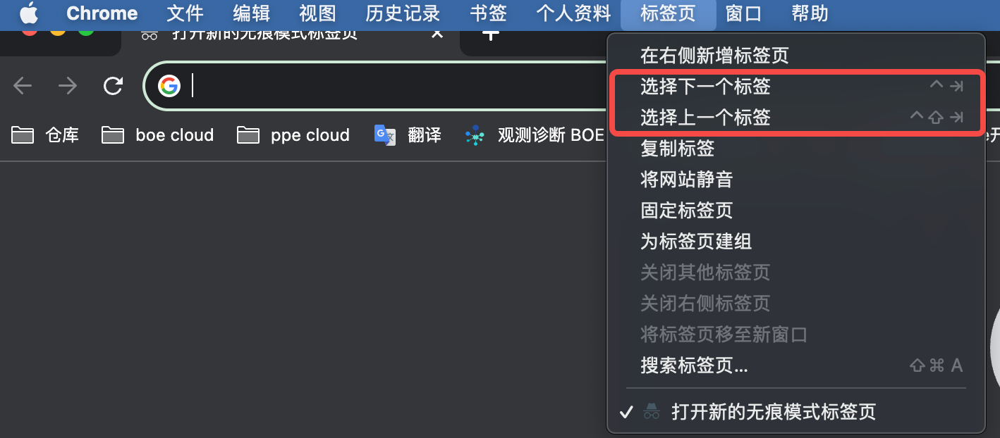
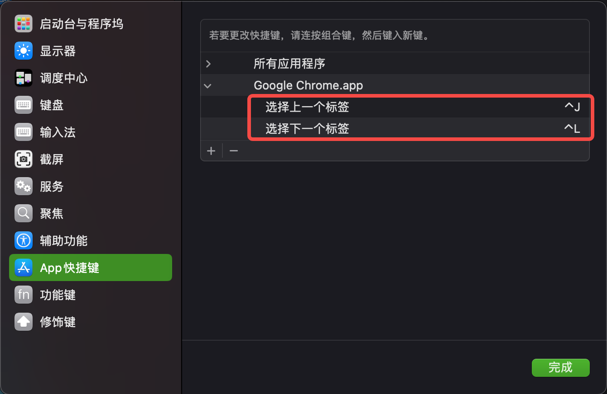
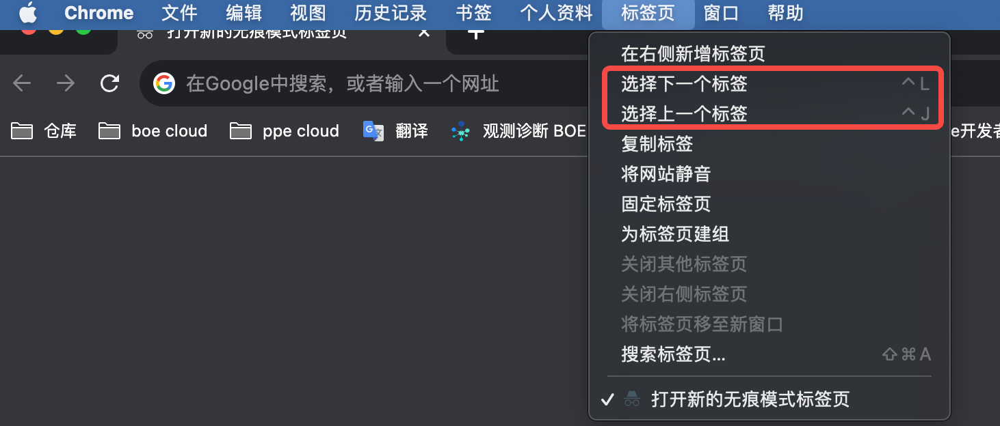
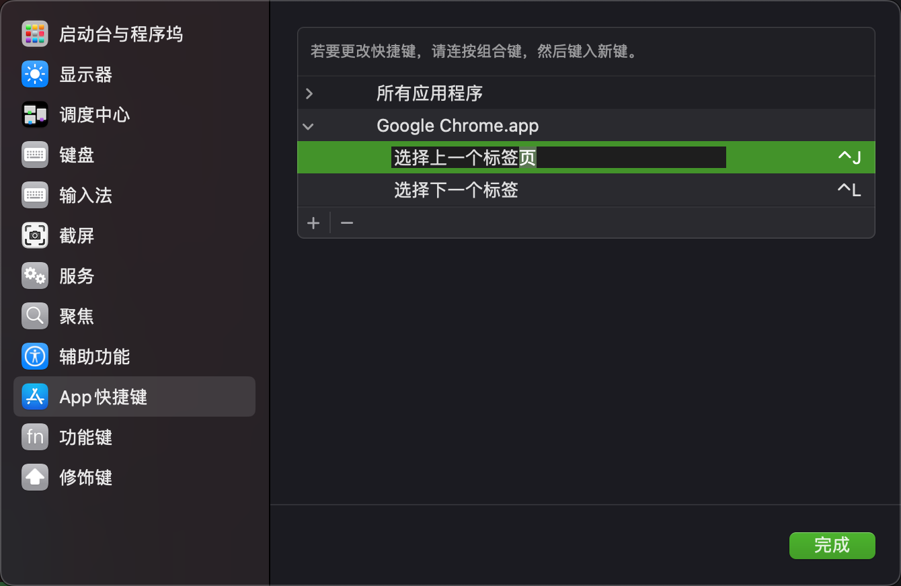

::: abstract
Chrome 切换标签页的默认快捷键是 <kbd>Ctrl</kbd>+<kbd>Tab</kbd>，如果想修改快捷键的话无法从 Chrome 内置的设置中修改，需要从 Mac 系统设置中添加。另外还通过可以`defaults`命令修改系统设置。
:::

<!-- more -->

## Mac 修改 App 快捷键

在 Google Chrome 中打开菜单栏的标签页，记下要添加的菜单项名字：


在系统设置的键盘快捷键中添加（key 需要与菜单项完全一致）：


快捷键已经生效了：


## 命令行修改系统设置

通过`defaults`命令赋值 key-value 可以修改 mac 系统中几乎所有的系统配置，脚本修改的优势在于可以快捷地在多台电脑之间同步配置。

```terminal
$ defaults write com.apple.universalaccess reduceMotion -int 1 # 打开“减少动画”开关
$ defaults read com.apple.universalaccess reduceMotion # 读取配置
1
```

> `com.apple.universalaccess` 是配置项的域，`reduceMotion`是配置项的 key，`1`是配置项的 value

下面是如何查找系统配置所对应的 defaults 配置项：

```terminal
$ git clone git@github.com:yannbertrand/macos-defaults.git
$ cd macos-defaults/
$ bash diff.sh
❓ Insert diff name (to store it for future usage) mytest
Saving plist files to '/Users/bytedance/install/macos-defaults/diffs/mytest' folder.

⏳ Change settings and press any key to continue
```

然后随便修改一下 App 的快捷键配置（这里是加了一个“页”字）：



确定后回到终端按回车，命令会输出这段时间 defaults 配置项的 diff：

```diff
@@ -16350,7 +16350,7 @@
         NSNavPanelExpandedStateForSaveMode = 1;
         NSNavPanelMediaBrowserTypeForOpenModeKey = 1;
         NSUserKeyEquivalents =         {
-            "\\U9009\\U62e9\\U4e0a\\U4e00\\U4e2a\\U6807\\U7b7e" = "^j";
+            "\\U9009\\U62e9\\U4e0a\\U4e00\\U4e2a\\U6807\\U7b7e\\U9875" = "^j";
             "\\U9009\\U62e9\\U4e0b\\U4e00\\U4e2a\\U6807\\U7b7e" = "^l";
         };
         "NSWindow Frame GoToSheet" = "538 312 460 364 0 0 1536 960 ";


➡️ and here with the `-currentHost` option


🔮 Commands to print the diffs again
$ git --no-pager diff --no-index diffs/mytest/old.plist diffs/mytest/new.plist
$ git --no-pager diff --no-index diffs/mytest/host-old.plist diffs/mytest/host-new.plist
```

可以看到 Chrome 快捷键的配置项的 key 是 NSUserKeyEquivalents，再执行命令查找域：

```terminal
$ defaults find NSUserKeyEquivalents
Found 1 keys in domain 'com.google.Chrome': {
    NSUserKeyEquivalents =     {
        "\\U9009\\U62e9\\U4e0a\\U4e00\\U4e2a\\U6807\\U7b7e\\U9875" = "^j";
        "\\U9009\\U62e9\\U4e0b\\U4e00\\U4e2a\\U6807\\U7b7e" = "^l";
    };
}
$ defaults read com.google.Chrome NSUserKeyEquivalents # 拿到了配置项的域、key以及value的格式
{
    "\\U9009\\U62e9\\U4e0a\\U4e00\\U4e2a\\U6807\\U7b7e\\U9875" = "^j";
    "\\U9009\\U62e9\\U4e0b\\U4e00\\U4e2a\\U6807\\U7b7e" = "^l";
}
$ defaults read-type com.google.Chrome NSUserKeyEquivalents # value的类型是字典类型
Type is dictionary
```

到目前拿到了配置项的域（com.google.Chrome）、key（NSUserKeyEquivalents）以及 value 的格式，可以通过命令来修改了：

```terminal
$ defaults write com.google.Chrome NSUserKeyEquivalents -dict \
  "选择上一个标签" "^j" \
  "选择下一个标签" "^l"
```

> `-dict`是覆盖赋值整个 map，`-dict-add` 是往 map 里添加

然后查看系统设置显示修改成功了，但是 Chrome 没有生效，通过 defaults 命令的修改需要重启 App 才能生效：

```terminal
$ killall "Google Chrome"
```

在配置完成后可以将脚本交给 **chezmoi** 来管理，后续任何改动都能快速同步到各个设备中。