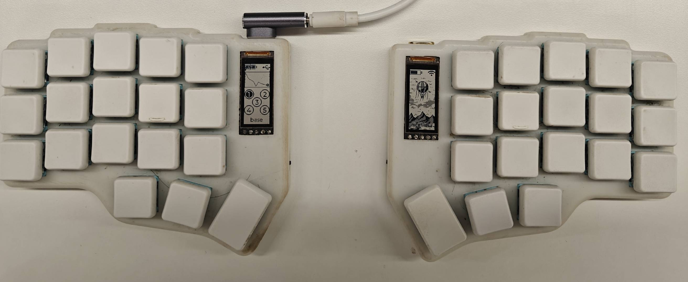
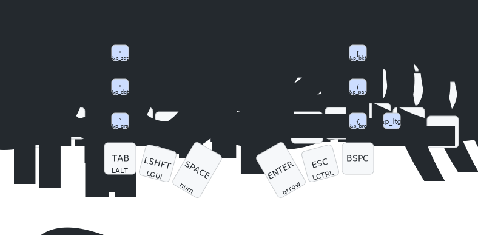
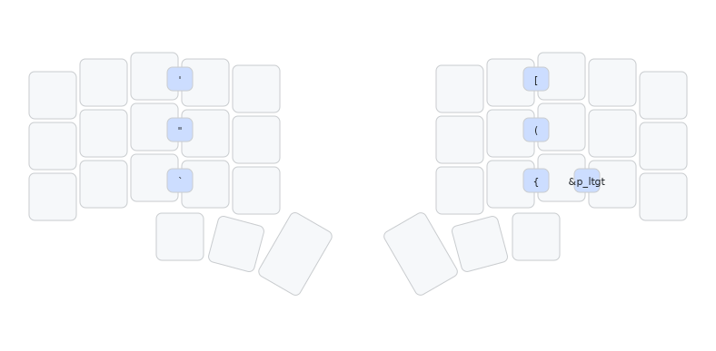
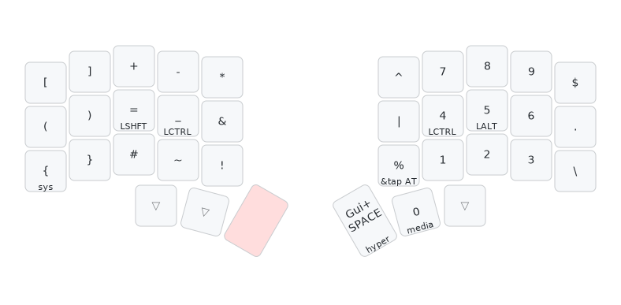
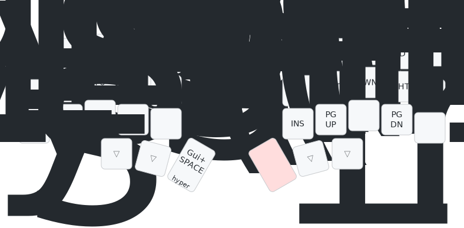
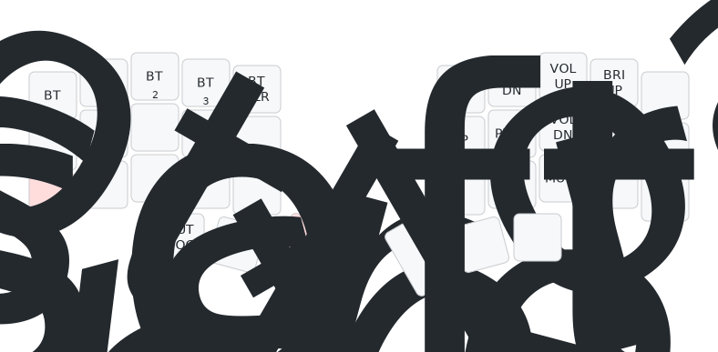
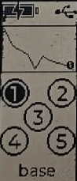

::: abstract
深度使用 Corne 键盘 21 个月后，我总结了这套 36 键方案的实践心得。本文将介绍键位布局设计、固件定制技巧、效率优化方案，以及针对编程场景的特殊优化。
:::

<!-- more -->

## 探索历程

2023 年在少数派的[《Planck配列键盘使用心得》](https://sspai.com/post/81740)一文中首次接触 40% 配列的直列键盘，随后淘宝购入 47 键 Planck 键盘。
购入的该键盘使用的是[QMK](https://github.com/qmk/qmk_firmware) 固件，支持自定义改键。
在改键过程中发现 47 键太多余了，最终选定 [Corne](https://github.com/foostan/crkbd) 36 键方案。

## 核心优势

### 人体工学设计

- **手指移动距离减少 60%**：除食指控制 6 键外，其余手指仅需操作 3 键，实现零腕部位移
- **小拇指负载降低 85%**：将高频功能键移至大拇指区，并压缩过长的空格键
- **腕部保持自然姿势**：无线分体设计支持自由调整双手间距

### 效率提升

| 操作                  | 传统键盘      | 36键方案       | 提升 |
| --------------------- | ------------- | -------------- | ---- |
| Esc/Backspace/Enter等 | 小拇指        | 大拇指         | 300% |
| 方向键                | 右手位移      | 层切换         | 200% |
| 符号输入              | 小拇指+组合键 | 层切换或Combos | 150% |

> [!note]
> 另外 Neovim 插件界的原神 Folke 近期也采用了 36 键方案：
>
> <blockquote class="twitter-tweet">
My newest build! <a href="https://twitter.com/hashtag/chocofi?src=hash&amp;ref_src=twsrc%5Etfw">#chocofi</a> <a href="https://t.co/wdzL3Ddx41">pic.twitter.com/wdzL3Ddx41</a>
&mdash; Folke Lemaitre (@Folke) <a href="https://twitter.com/Folke/status/1706704935650205872?ref_src=twsrc%5Etfw">September 26, 2023</a></blockquote> 

## 固件选型

目前主流的开源键盘固件是 [QMK](https://github.com/qmk/qmk_firmware) 和 [ZMK](https://github.com/zmkfirmware/zmk)。

- QMK: 仅支持有线连接，支持通过 [Vial](https://get.vial.today/) 网页直接对键盘改键，有非常炫酷的 RGB 灯效，适合桌面固定场景
- ZMK: 支持有线或者蓝牙，代码化配置（但不强制要求编译环境，可通过 [GitHub Action](https://github.com/Urie96/zmk/actions) 自动编译），低功耗设计，适合移动办公场景。

最终选择 ZMK 固件，因其：

1. 支持分体式蓝牙连接（主从模式）
2. 配置即代码的版本控制优势

> ZMK 采用左手主控设计：右手仅发送物理按键事件到左手，左手负责键码映射并与电脑交互。因此仅更新按键配置时，只需刷写左手固件。

## 键位设计

> [!tip]
> 完整配置见 [GitHub 仓库](https://github.com/Urie96/zmk-config/blob/main/config/corne.keymap)

### 基础层布局（Layer 0）

上面 3 排共 30 按键包括 26 个字母，以及写代码常用的 4 个符号键（<kbd>,</kbd>、<kbd>.</kbd>、<kbd>:</kbd>和<kbd>/</kbd>）。

ZMK 的[Hold Tap](https://zmk.dev/docs/keymaps/behaviors/hold-tap)（长按变形）支持长按触发不同的键码，我将上面 3 排每个键配置了长按自动带上<kbd>Shift</kbd>。
比如长按<kbd>a</kbd>输出`A`，长按<kbd>/</kbd>输出`?`，长按<kbd>Ctrl + a</kbd> 输出 `Ctrl + Shift + a`。

> [!warning]
> 不过 36 键主流是使用 [home row mods](https://precondition.github.io/home-row-mods)，也就是将长按主行 （`asdfjkl;`）作为 4 个修饰键(<kbd>Command</kbd>、<kbd>Option</kbd>、<kbd>Control</kbd> 和<kbd>Shift</kbd>)。
> 比如长按 <kbd>f</kbd> 或 <kbd>j</kbd> 会映射为 `Shift`，先按下 <kbd>f</kbd> 再单击 <kbd>h</kbd> 会输出 `Shift + h`。

除此之外，[Tap Dance](https://zmk.dev/docs/keymaps/behaviors/tap-dance)（连点变形）还支持多次点击同一个按键发出不同的键码。
比如可以配置单击<kbd>a</kbd>输出`1`，快速连按两次<kbd>a</kbd>输出`2`，连按三次输出 `3`。

但是这会有延迟问题，比如我想单击一次输入`1`，因为配置了连续点击，键盘会等 50ms（可配置）看我会不会再按下这个键，所以单击之后需要等待 50ms 或者按下其他键才会输出`1`。
我个人不喜欢这种有延迟的体验，没有使用这种特性（下文会魔改这个特性以去除延迟）。

最下面一排是由大拇指控制的 6 个功能键，分别是 <kbd>Tab</kbd>, <kbd>Sticky Shift</kbd>, <kbd>Space</kbd>, <kbd>Enter</kbd>, <kbd>Esc</kbd> 和 <kbd>Backspace</kbd>。

一般长按 <kbd>Esc</kbd> 等键没有任何意义，所以我通过**长按变形特性**将这些键的长按映射为修饰键：长按<kbd>Esc</kbd>输出 `Ctrl`，长按<kbd>Tab</kbd>输出`Option`。
不过没有将长按<kbd>Backspace</kbd>配置为其他键码，因为需要用于大量删除字符。

> [!tip]
> 长按不代表必须要长按，只要在按下期间又按了其他按键就会视为长按，非常丝滑。

ZMK 的另一个特性是[Sticky Key](https://zmk.dev/docs/keymaps/behaviors/sticky-key)（粘滞键），按下粘滞键不会有任何输出，只会在下一次按任意键时自动带上该键。
比如单击<kbd>Sticky Command</kbd>键之后，再单击<kbd>a</kbd>会输出`Command + a`。

[Mod Morph](https://zmk.dev/docs/keymaps/behaviors/mod-morph)（修饰变形）支持在修饰键按下时单击某键发出不同键码。
假如我配置<kbd>a</kbd>键对`Control`变形为`b`，那么我按下<kbd>Control + a</kbd>会输出`b`，而不是`Control + a`。

一个非常巧妙的设计是**长按变形**、**修饰变形**与**粘滞键**三种特性配合，可以将多种功能组合到一个按键上，以上图的<kbd>LSHFT</kbd>为例：

1. 单击时利用**粘滞键**特性，进入粘滞 Shift 状态，**下一次**按键会自动带上 Shift。
2. 长按时利用**长按变形特性**输出`Command`。比如按住此键再单击<kbd>a</kbd>输出`Command + a`。
3. 单击进入粘滞 Shift 后，如果再单击此键（也就是双击），利用**修饰变形特性**改为触发[单词大写](https://zmk.dev/docs/keymaps/behaviors/caps-word)模式，后续输入的第一个单词会自动大写，期间单击其他非字母键（不包括<kbd>\_</kbd>和<kbd>Backspace</kbd>）则会自动退出单词大写模式。

### Combos

[Combos](https://zmk.dev/docs/keymaps/combos)（多键组合变形），同时按下多个键发出其他键码。
我将同时按下<kbd>u</kbd>和<kbd>i</kbd>配置为输出`[`，同时按下<kbd>e</kbd>和<kbd>r</kbd>输出`'`。

[Macros](https://zmk.dev/docs/keymaps/behaviors/macros)（宏），一次按键发出多个键码。
比如可以配置长按<kbd>@</kbd>输出`@gmail.com`。

配合**多键变形**、**长按变形**以及**宏** ，我同时按下<kbd>u</kbd>和<kbd>i</kbd>并持续 300ms 会输出 3 个键码(`[`、`]`、`<Left>`)，这可以方便地输入括号并将光标置于括号之中，同时长按<kbd>e</kbd>和<kbd>r</kbd>输出`'`、`'`、`<Left>`。

### 数字符号层布局（Layer 1）

当长按<kbd>Space</kbd>期间切换到第 1 层（[Layers](https://zmk.dev/docs/keymaps/behaviors/layers)）。

模仿键盘的小键盘区，数字键以九宫格排列。

### 方向功能层布局（Layer 2)

当长按<kbd>Enter</kbd>期间，切换到第 2 层。

<kbd>Enter</kbd>和方向键都在右手，这使得可以单手按方向键。

<kbd>Left</kbd>和<kbd>Right</kbd>的上边<kbd>Home</kbd>和<kbd>End</kbd>，下边是<kbd>PageUp</kbd>和<kbd>PageDown</kbd>，这样的布局很容易记忆。

左手就是 <kbd>F1 - F15</kbd>，长按会带上<kbd>Shift</kbd>，这对于一些快捷键有帮助。

### 系统层布局（Layer 3)

在第 1 层激活时，再长按<kbd>{</kbd>进入第 3 层。

左手第一排用于切换不同的蓝牙配置。比如单击<kbd>BT 1</kbd>之后，键盘就使用 1 号配置，如果 1 号没有配对，那就可以和电脑配对，如果 1 号已配对，也可以点击<kbd>BT CLR</kbd>来清除配对。
所以可以让 1 号配置和笔记本配对，2 号配置和台式机配对，通过按键切换配置后，就可以控制不同的设备了。

右手则是一些媒体键，比如音量键、亮度调节、上一曲、下一曲、暂停、静音。

拇指区则是一些日常用的比较少的功能，专门放在了很别扭的位置，目的是为了防止误按。

- <kbd>OUT TOG</kbd>: 充电时，键盘默认会通过 USB 连接，如果这时候想用蓝牙连接其他设备，可以单击此键切换到蓝牙连接模式。
- <kbd>&sys_reset</kbd>: 软件重置单侧键盘，用得比较少，一般我通过硬件按钮重置。
- <kbd>&bootloader</kbd>: 进入固件更新模式，开启后键盘成了一个 USB 设备，可以从电脑上把新固件放进去。
- <kbd>&soft_off</kbd>: 键盘进入睡眠模式，使用较少，因为有硬件开关，直接关电源更彻底。

### Hyper层布局（Layer 4)

同时长按 <kbd>Space</kbd>和<kbd>Enter</kbd> 进入第 4 层，这一层的所有按键会自动带上<kbd>Control</kbd>、<kbd>Command</kbd>、<kbd>Option</kbd>，提供更多可分配的快捷键。

在这层单击<kbd>a</kbd>输出`Control + Command + Option + a`，如果是长按<kbd>a</kbd>则输出`Control + Command + Option + Shift + a`。

## 屏幕介绍

屏幕采用[nice!view](https://nicekeyboards.com/nice-view)，它拥有 30Hz 的刷新率，但功耗与墨水屏相当。

### 左边屏幕

| `左手电量` `USB/蓝牙/未连接` |
| :--------------------------: |
|        `每分钟打字数`        |
|       `激活的蓝牙配置`       |
|         `当前激活层`         |

### 右边屏幕

| `右手电量` `是否已连接左手` |
| :-------------------------: |
|         `随机图片`          |

## 我对 ZMK 源码的扩展改造

### 系统信息输出

目前 ZMK 的电量可以通过键盘屏幕或者电脑端查看双手蓝牙电量（电脑查看右手蓝牙电量需要系统支持）。
但 nice!view 屏幕国内几乎已绝版，国外也至少需要一百多一个，且主流的 oled 屏幕非常耗电，不适合无线键盘使用，所以我下一个键盘不会加屏幕，这样制作起来也更简单。
没有屏幕，那原本屏幕上的信息如何查看呢，于是我在 fork 的 ZMK 源码中加了`&sys_info`（[点此查看代码](https://github.com/Urie96/zmk/commit/6c73248a7b0a2c4431c9878c92097eb3f62f4225)）。

在按键中配置 `&sys_info` 后，按下这个键，键盘就会输出一连串的字母，就能在电脑上看到这些信息了。
比如我现在按下 `&sys_info` ，输出了`c_lvl: 100%, p_lvl: 71%, ctl: usb, ble: 1, build Jul 14 2024 15:59:10`。
里面的信息包含：左手电量 100%，右手电量 71%，通过 USB 连接，蓝牙使用 1 号配置，左手固件编译时间为 2024 年 7 月 14 日 15:59:10。

### 无延迟版 Tap Dance

**连点变形特性**功能固然强大，但是单键输出延迟让人难以接受。
理论上如果我保证第二次按键兼容前一次按键输出的字符，完全可以做到 0 延迟。
比如写代码经常遇到`!=`，单击<kbd>!</kbd>输出`!`，连点两次<kbd>!</kbd>输出`!=`，连点三次<kbd>!</kbd>输出`!==`。
每一次连点只需要追加新的字符即可（比如200ms 内重复按<kbd>!</kbd>输出`=`），可惜 ZMK 并不支持。
所以我就在原有的连点变形特性代码上添加了 `no-delay` 属性（[点此查看代码](https://github.com/Urie96/zmk/commit/2d16679d32004fe4dbd72005b9e4e60a52fb9410#diff-7eeba6e44a877bcea40b140ff0aaed1559f31fdea34ba7f71f0223b84c68e881)）来实现。

> [!TIP]
> 下面会继续扩展，配置一些键盘的预设场景，比如仅在 Golang 场景中启用双击 <kbd>:</kbd> 输出 `:=`等。
> 这些我在[通过 Rime 输入法实现快速连按输入不同符号](./rime-speed-up-code.md)中也从软件层面来实现了。

### 语言场景支持

在不同语言中，不同符号的使用频率不同，比如 Golang 中<kbd>:</kbd>比<kbd>;</kbd>使用更频繁，而 nix 和 C 等语言中却相反。
ZMK 缺少场景这种特性，所以我实现了`&ms`行为（[点此查看代码](https://github.com/Urie96/zmk/commit/24b0c0f481c97e356779356e00a5e420120949ab)）。
支持给指定的某些键配置若干套场景，不同场景时使用不同的键码，以及有一个特殊键用来切换场景。
比如在 Golang 场景中，<kbd>:</kbd>和<kbd>;</kbd>交换位置，在 Lua 场景中双击<kbd>~</kbd>输出`~=`。
